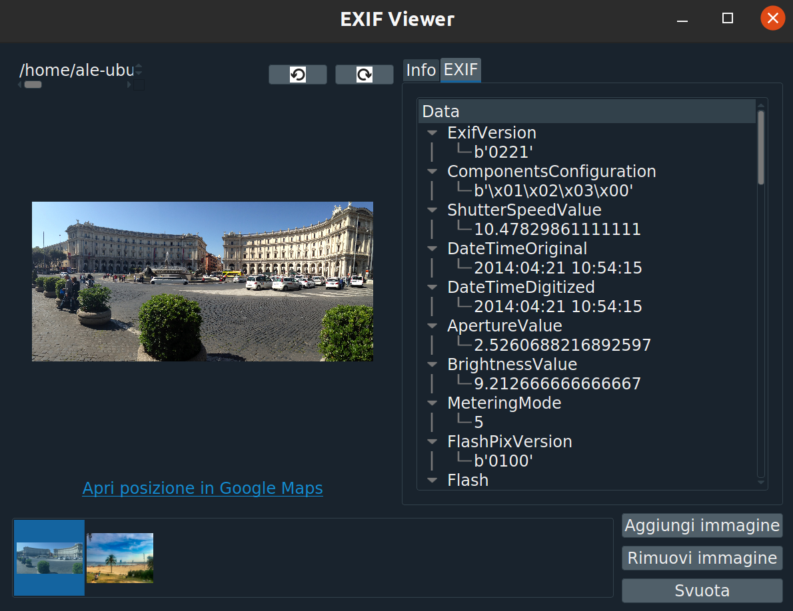

# EXIF-Viewer

Il progetto consiste in una semplice applicazione Python che permette di visualizzare gli EXIF di immagini selezionate in input. 
L'elaborato è stato realizzato come Programming Assignment del corso di Human Computer Interaction previsto dal corso di Laurea Magistrale in Ingegneria Informatica dell'Università degli Studi di Firenze.

<h2>L'applicazione</h2>
Di seguito si riporta un esempio di schermata dell'applicazione. 
La vista consente innanzitutto di gestire una coda di immagini, mostrata sul fondo dell'interfaccia, tramite i pulsanti posti sulla destra, attraverso i quali è infatti possibile aggiungerne di nuove e rimuovere solo quella selezionata oppure tutte quelle presenti. 
Si noti come sia anche possibile aggiungere un'immagine alla coda attraverso un'operazione di drag & drop, ovvero semplicemente trascinando il file ad essa associato nella sezione della schermata riservata alla visualizzazione delle immagini. 
Selezionando un'immagine presente nella coda, questa viene mostrata nella sezione ad essa dedicata al centro della finestra, dove sulla sinistra è rappresentata
l'immagine stessa mentre sulla destra sono presenti gli EXIF e le sue info (nome del file, estensione, dimensione ecc.). 
Attraverso gli appositi pulsanti è anche possibile modificare la rappresentazione dell'immagine ruotandola in senso orario o antiorario. 
Inoltre se l'immagine è stata acquisita salvando i dati relativi alla geolocalizzazione, è possibile, premendo sull'apposito link
posto sotto ad essa, aprire la posizione in cui questa è stata scattata su Google Maps.

  

    </img> 

  

<h2>Tecnologie utilizzate</h2>
L'elaborato è stato implementato in linguaggio Python 3. 
Nello specifico le dipendenze del progetto sono le seguenti:
<ul>
    <li><b>Python</b>: v.3.7</li>
    <li><b>PyQt</b>: v.5.9.2</li>    
    <li><b>Pillow</b>: v.8.1.0</li>    
    <li><b>Qdarkstyle</b>: v.2.8.1</li>
</ul>
La librerie PyQt5 e Pillow sono state utilizzate rispettivamente per definire l'interfaccia dell'applicazione e per leggere il contenuto delle immagini da file.
La libreria Qdarkstyle invece è opzionale ed il suo utilizzo permette di definire la schermata col tema dark attivo, così come è mostrata nella figura d'esempio sopra riportata.

<h2>Come eseguire</h2>
Per lanciare l'applicazione è sufficiente:
<ul>
    <li>Installare le dipendenze specificate al punto precedente </li>
    <li>Eseguire il modulo <em>main.py</em> </li>    
</ul>

<h2>Implementazione</h2>
L'applicazione fa uso della tecnica Model-View-Controller che prevede di dividere il codice che definisce l'interfaccia utente da quello che accede ai modelli. 
Il progetto si compone nello specifico di tre moduli principali:
<ul>
    <li><em>ExifView</em>: definisce l'oggetto relativo all'unica finestra prevista dall'applicazione. La classe definita all'interno del file fa uso delle classi 
    implementate in <em>ExifWidgets</em>, le quali si occupano di definire i singoli oggetti che compongono la schermata principale. Per l'implementazione dell'interfaccia è stata usata la libreria PyQt5.</li>
    <li><em>ExifModel</em>: contiene la classe che tiene traccia dei dati memorizzati dall'applicazione, dove questi consistono nelle immagini appartenenti alla coda, nell'indice di quella correntemente selezionata e nei suoi metadati (info ed EXIF). </li>
    <li><em>ExifController</em>: si occupa di fare da ponte tra la vista ed il modello, consentendo di accedere a quest'ultimo ogni qualvolta l'utente interagisce con la schermata.</li>
</ul>
